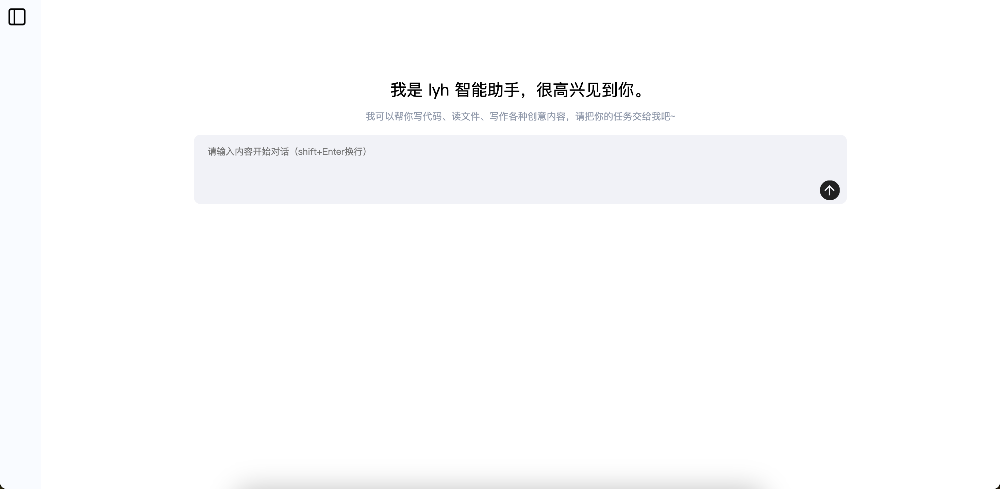
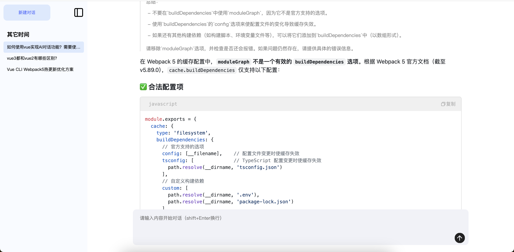

# lyh-ai-chat UI

一个基于 Vue3 的 ai 对话界面，支持多轮对话、代码高亮、复制、思考过程折叠等功能。


## 技术栈
Vue 3 + Vite + vue-router + markdown-it + highlight.js + @microsoft/fetch-event-source

## 快速开始

### 克隆仓库
git clone https://github.com/lyh-night/lyh-ai-chat.git
cd lyh-ai-chat

### 安装依赖
npm install

### 启动项目
npm run dev

### 构建生产包
npm run build

## 预览




## 项目结构

```txt
lyh-ai-chat
├── public
├── src
│   ├── api # API请求
│   ├── assets # 静态资源文件
│   ├── components # 全局组件
│   ├── router # 路由
│   ├── stores # 状态管理
│   ├── styles # 全局样式
│   ├── utils # 工具类函数
│   └── views # 页面视图
│   └── App.vue # 入口文件
│   └── mian.js # 项目入口
├── .editorconfig
├── .env.development
├── .env.production
├── .eslintignore
├── .eslintrc-auto-import.json
├── .eslintrc.cjs
├── .gitignore
├── .prettierrc.cjs
├── index.html
├── jsconfig.json
├── package.json
├── pnpm-lock.yaml
├── README.md
└── vite.config.js
```

## License

MIT License © 2025 lyh
